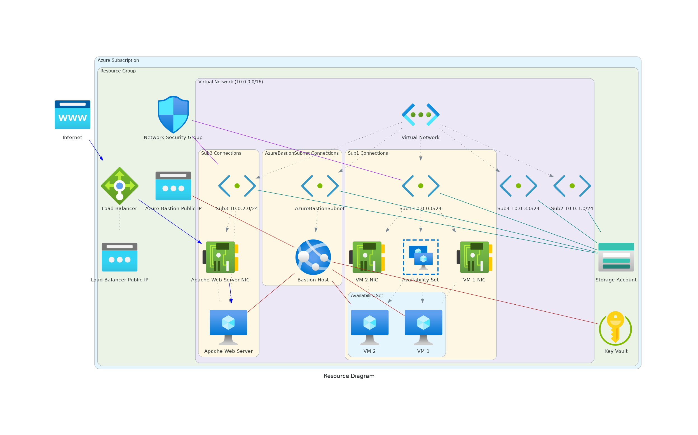

## Overview

This Terraform configuration deploys a highly available and secure infrastructure on Azure, which includes:

- A virtual network with customizable subnets
- A bastion host for secure remote access 
- An availability set containing two virtual machines
- A linux virtual machine running an apache web server behind a load balancer
- A network security group associated with subnets 1 and 3
- An Azure key vault which contains the ssh keys for the virtual machines
- A storage account accessible only from the virtual network
- Tags applied to all resources

## Architecture

## Terraform Documentation

View Terraform Documentation

## Requirements

| Name | Version |
|------|---------|
|  [azurerm](#requirement\_azurerm) | ~> 4.0 |
|  [random](#requirement\_random) | ~> 3.0 |  
|  [tls](#requirement\_tls) | ~> 4.0 |

## Providers

| Name | Version |
|------|---------|
|  [azurerm](#provider\_azurerm) | 4.13.0 |
|  [random](#provider\_random) | 3.6.3 |
|  [tls](#provider\_tls) | 4.0.6 |

## Modules

No modules.

## Resources

| Name | Type |
|------|------|
| [azurerm_availability_set.avset](https://registry.terraform.io/providers/hashicorp/azurerm/latest/docs/resources/availability_set) | resource |
| [azurerm_bastion_host.bastion](https://registry.terraform.io/providers/hashicorp/azurerm/latest/docs/resources/bastion_host) | resource |
| [azurerm_key_vault.kv](https://registry.terraform.io/providers/hashicorp/azurerm/latest/docs/resources/key_vault) | resource |
| [azurerm_key_vault_secret.apache](https://registry.terraform.io/providers/hashicorp/azurerm/latest/docs/resources/key_vault_secret) | resource |
| [azurerm_key_vault_secret.vm](https://registry.terraform.io/providers/hashicorp/azurerm/latest/docs/resources/key_vault_secret) | resource |
| [azurerm_lb.lb](https://registry.terraform.io/providers/hashicorp/azurerm/latest/docs/resources/lb) | resource |
| [azurerm_lb_backend_address_pool.lb_be_pool](https://registry.terraform.io/providers/hashicorp/azurerm/latest/docs/resources/lb_backend_address_pool) | resource |
| [azurerm_lb_probe.lb_probe](https://registry.terraform.io/providers/hashicorp/azurerm/latest/docs/resources/lb_probe) | resource |
| [azurerm_lb_rule.lb_rule](https://registry.terraform.io/providers/hashicorp/azurerm/latest/docs/resources/lb_rule) | resource |
| [azurerm_linux_virtual_machine.apache](https://registry.terraform.io/providers/hashicorp/azurerm/latest/docs/resources/linux_virtual_machine) | resource |
| [azurerm_linux_virtual_machine.vm](https://registry.terraform.io/providers/hashicorp/azurerm/latest/docs/resources/linux_virtual_machine) | resource |
| [azurerm_network_interface.apache_nic](https://registry.terraform.io/providers/hashicorp/azurerm/latest/docs/resources/network_interface) | resource |
| [azurerm_network_interface.nic](https://registry.terraform.io/providers/hashicorp/azurerm/latest/docs/resources/network_interface) | resource |
| [azurerm_network_interface_backend_address_pool_association.apache_assoc](https://registry.terraform.io/providers/hashicorp/azurerm/latest/docs/resources/network_interface_backend_address_pool_association) | resource |
| [azurerm_network_security_group.nsg](https://registry.terraform.io/providers/hashicorp/azurerm/latest/docs/resources/network_security_group) | resource |
| [azurerm_network_security_rule.allow_http](https://registry.terraform.io/providers/hashicorp/azurerm/latest/docs/resources/network_security_rule) | resource |
| [azurerm_network_security_rule.allow_ssh](https://registry.terraform.io/providers/hashicorp/azurerm/latest/docs/resources/network_security_rule) | resource |
| [azurerm_public_ip.bastion](https://registry.terraform.io/providers/hashicorp/azurerm/latest/docs/resources/public_ip) | resource |
| [azurerm_public_ip.lb_pip](https://registry.terraform.io/providers/hashicorp/azurerm/latest/docs/resources/public_ip) | resource |
| [azurerm_resource_group.rg](https://registry.terraform.io/providers/hashicorp/azurerm/latest/docs/resources/resource_group) | resource |
| [azurerm_storage_account.storage](https://registry.terraform.io/providers/hashicorp/azurerm/latest/docs/resources/storage_account) | resource |
| [azurerm_subnet.bastion](https://registry.terraform.io/providers/hashicorp/azurerm/latest/docs/resources/subnet) | resource |
| [azurerm_subnet.subnet](https://registry.terraform.io/providers/hashicorp/azurerm/latest/docs/resources/subnet) | resource |
| [azurerm_subnet_network_security_group_association.allow_http_subnet3](https://registry.terraform.io/providers/hashicorp/azurerm/latest/docs/resources/subnet_network_security_group_association) | resource |
| [azurerm_subnet_network_security_group_association.allow_ssh_subnet1](https://registry.terraform.io/providers/hashicorp/azurerm/latest/docs/resources/subnet_network_security_group_association) | resource |
| [azurerm_virtual_network.vnet](https://registry.terraform.io/providers/hashicorp/azurerm/latest/docs/resources/virtual_network) | resource |
| [random_bytes.random](https://registry.terraform.io/providers/hashicorp/random/latest/docs/resources/bytes) | resource |
| [tls_private_key.apache_ssh](https://registry.terraform.io/providers/hashicorp/tls/latest/docs/resources/private_key) | resource |
| [tls_private_key.vm_ssh](https://registry.terraform.io/providers/hashicorp/tls/latest/docs/resources/private_key) | resource |
| [azurerm_client_config.current](https://registry.terraform.io/providers/hashicorp/azurerm/latest/docs/data-sources/client_config) | data source |

## Inputs

| Name | Description | Type | Default | Required |
|------|-------------|------|---------|:--------:|
|  [environment](#input\_environment) | Environment | `string` | n/a | yes |
|  [location](#input\_location) | Location | `string` | n/a | yes |
|  [project\_name](#input\_project\_name) | Project Name | `string` | n/a | yes |
|  [subscription\_id](#input\_subscription\_id) | Subscription ID | `string` | n/a | yes |
|  [virtual\_network\_config](#input\_virtual\_network\_config) | The configuration for the virtual network. | <pre>object({     base_cidr    = string     subnet_count = number   })</pre> | n/a | yes |

## Outputs

No outputs.

